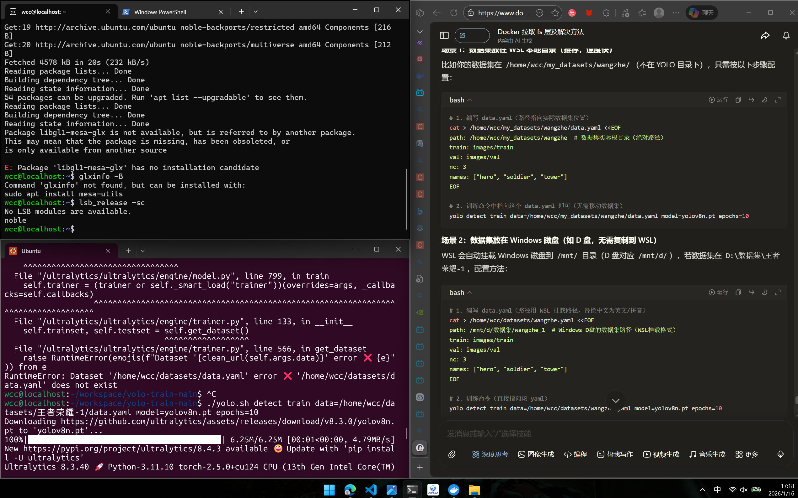
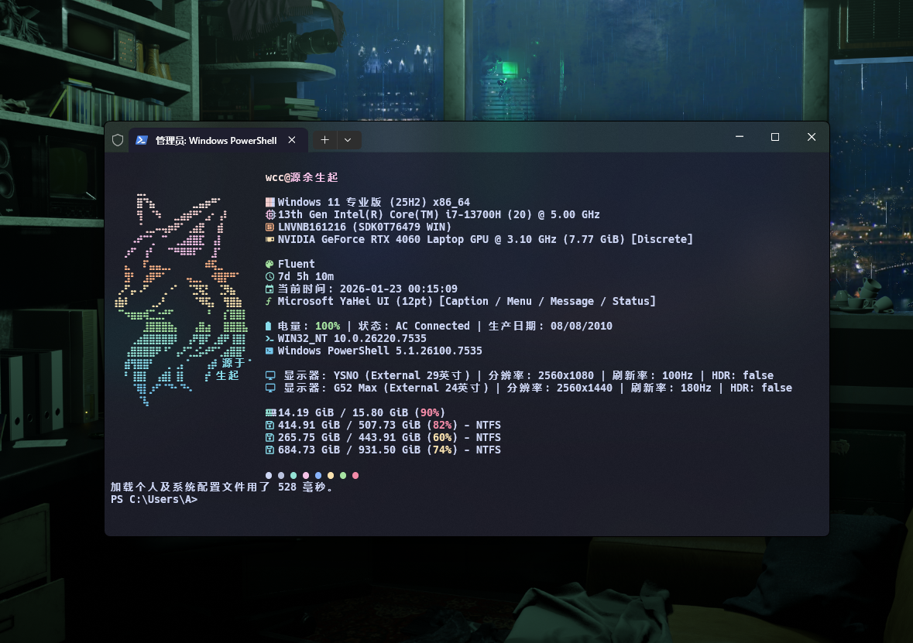
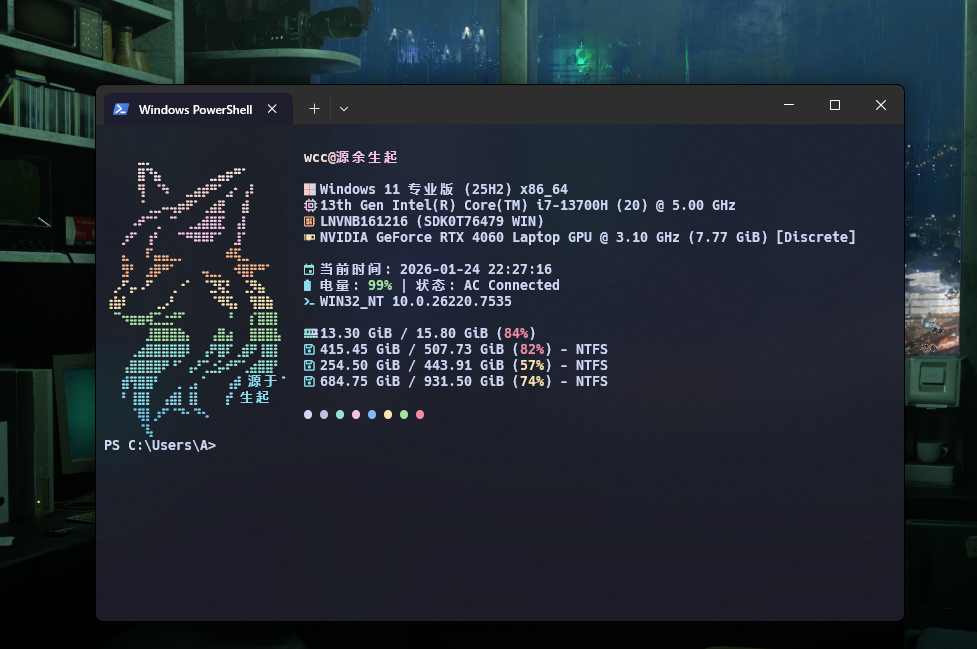

# lua和love2d引擎

SNKRX的[前身教程](https://github.com/a327ex/boipushy#),教程包括lua,love2d

## 日志

##### 2026/1/12  

熟悉lua的面向编程,lua里没有内置的类,需要用表和函数实现,这里的oop是第三方的库[rxi/classic](https://github.com/rxi/classic)
用法

```lua
class = request "classic"
rect = class:expend() --创建类

function rect:new(posx,posy,x,y)--创建方法
self.posx = posx or 0
self.posy = posy or 0
self.x = x or 100
self.y = y or 100
end

function rect:draw()

end

function rect:fadein()

end
```

---

##### 2026/1/14  

练习 `hump.timer` 的 `after` 与 `tween`，写了`HpRect`类。

```lua
timer:tween(0.1 * self.speed, self, { rectside = { x = self.faderectside.x } }, 'in-linear', function()
                timer:tween(0.1 * self.speed, self, { bkrectside = { x = self.rectside.x } }, 'in-quad', function())
                end)
```

##### timer

- 这里的[timer](https://hump.readthedocs.io/en/latest/timer.html)是[hump](https://github.com/vrld/hump)其中的一个类,timer内置了许多方法,最常用的有`after`,`tween`,`every`,`during`.

```lua
timer = request "timer"

function love.load()
    time=timer()
end

function love.update(dt)
    time:update(dt)
    time:after(3,function() print(love.math.random()) end)
    time:every(1,function() print("已过1秒") end ,3)

    timer:every(1, function printTime() end) 
    timer:every(1,printTime) 
    --以上两种用法输出结果一样,注意直接调用显名函数不需要()
    --注意不能直接在love.update,love.draw调用,会一直重复调用
    
end

function printTime()
    print("已过1秒")
end
```

这里的`after`将会在过3秒和6秒时随机打印一个数,`every`则会每秒输出一次`已过1秒`总共输出3次,若没有`3`则会一直循环,特别注意不要在持续快速调用的函数内直接使用timer,会出现重复调用的bug,重复次数跟调用次数有关,类似`love.update()`,`love.draw()`

另外hump的timer类并不支持在`timer:xxx(num,function() end,num)`里面直接调用具名(显性申明)函数,但能通过匿名函数调用具名函数,强行调用也回出现重复调用的bug

- `after`

```lua
timer:after(delay,func)   --(延迟dlay秒后执行,执行的匿名函数)

```

- `every`

```lua
timer:every(dlay,func,count)   --(延迟dlay秒后执行,执行的匿名函数,执行延迟次数)
```


- `tween` 补间动画

hump.timer 提供了两种补间动画接口：底层接口 `Timer.during()`和高级接口 `Timer.tween()`

 ```lua
timer.tween(duration, subject, target, method, after, ...)
```

有多种补间模式`linear`, `quad`, `cubic`, `quart`, `quint`, `sine`, `expo`, `circ`, `back`, `bounce`, 和 `elastic`.

可以自定义插值方法,[详情见官方文档](https://hump.readthedocs.io/en/latest/timer.html#Timer.cancel)


- `during`

```lua
Timer.during(delay, func, after)
```


- `script`

```lua
timer.script(func) --传入的方法,内置的仅有wait

timer:script(function(wait)
        while true do
            print("This message appears every 3 seconds.")
            wait(3)
        end
    end)
```

每三秒输出


- `new` 创建新计时器

```lua
timer.new()
```
适用于挂载在敌人等实体


- `cancel`  取消计时器实例

```lua
timer.cancel(handle)


function tick()
    print('tick... tock...')
end
handle = Timer.every(1, tick)
-- later
Timer.cancel(handle) -- 不是: Timer.cancel(tick)


-- using a timer instance
function tick()
    print('tick... tock...')
end
handle = menuTimer:every(1, tick)
-- later
menuTimer:cancel(handle)

```


- `clear`  移除所有定时和周期性函数。尚未执行的函数将被丢弃。

```lua
Timer.clear()

menuTimer:clear()
```

- `update`

```lua
timer.update(dt)
```
更新计时器并在达到截止时间时执行函数。在 love.update(dt) 中调用

---

##### 2026/1/18

研究comfyUI,和怎么在HugginggFace下模型,终端一直在报错`= =` 整天都在面對CMD，PSL，WSL，该死的wsl，各种依赖一直报错，但我还是很喜欢Linux，命令行其实也挺好用的

---

##### 2026/1/20

- 重构了`HPrect`

<details>
<summary>点击展开：完整的 Lua Timer 代码</summary>
 ```lua
 ocal HpRect = class:extend()

function HpRect:new(rectsidemax, maxhp, minhp, pos, hpcolor, bkcolor, speed)
    self.maxhp = maxhp or 100
    self.minhp = minhp or 0
    self.currenthp = self.maxhp
    self.rectsidemax = rectsidemax or { x = 200, y = 35 } --初始血量矩形大小,便于计算血量比例
    --后续改用color类来表示颜色
    self.hpcolor = hpcolor or { 255 / 255, 89 / 255, 89 / 255 }
    self.bkcolor = bkcolor or { 226 / 255, 37 / 255, 50 / 255 }
    self.bkrectside = self.rectsidemax --背景矩形大小
    self.rectside = rectsidemax or { x = 200, y = 35 }
    self.pos = pos or { x = 100, y = 100 }
    self.speed = speed or 3                                          --血量动画速度
    self.faderectside = { x = self.rectside.x, y = self.rectside.y } --缓冲血量
end

--扣血实现,在main.lua中调用,例如：hpRect:hurt(10) 表示扣10点血
function HpRect:hurt(damage)
    if self.currenthp > self.minhp and self.rectside.x > 0 then
        self.currenthp = math.max(self.currenthp - damage, self.minhp)
        self.faderectside.x = (self.currenthp / self.maxhp) * self.rectsidemax.x
        -- 确保目标宽度不为负数
        self.faderectside.x = math.max(self.faderectside.x, 0)

        if self.faderectside.x > 0 then
            timer:tween(0.1 * self.speed, self, { rectside = { x = self.faderectside.x } }, 'in-linear', function()
                -- tween 完成后再次强制非负，防止多次快速调用产生负值
                self.rectside.x = math.max((self.rectside.x or 0), 0)
                timer:tween(0.1 * self.speed, self, { bkrectside = { x = self.rectside.x } }, 'in-quad', function()
                    self.bkrectside.x = math.max((self.bkrectside.x or 0), 0)
                end)
            end)
        else
            self.rectside.x = 0
            self.bkrectside.x = 0
        end
    end
end

function HpRect:draw(x, y)
    if x == nil and y == nil then
        love.graphics.setColor(self.bkcolor)
        love.graphics.rectangle("fill", love.graphics.getWidth() / 2 - self.pos.x,
            love.graphics.getHeight() / 2 - self.bkrectside.y / 2, self.bkrectside.x, self.bkrectside.y)                                                                   --HP背景
        love.graphics.setColor(self.hpcolor)
        love.graphics.rectangle("fill", love.graphics.getWidth() / 2 - self.pos.x,
            love.graphics.getHeight() / 2 - self.rectside.y / 2, self.rectside.x, self.rectside.y)                                                                         --血量
    else
        love.graphics.setColor(self.bkcolor)
        love.graphics.rectangle("fill", x, y, self.bkrectside.x, self.bkrectside.y) --HP背景
        love.graphics.setColor(self.hpcolor)
        love.graphics.rectangle("fill", x, y, self.rectside.x, self.rectside.y)     --血量
    end
end 
</details>
```


- 新增了`input`[类](https://github.com/a327ex/boipushy#),可以直接在`update()`执行交互逻辑了

 `input`使用前需要先绑定按键,按键可以绑定动作

 ```lua
    input:bind("q", "hurt")
 ```

这里将`q`键绑定到`hurt`这个动作,使用时可以直接如上图所示判断`hurt`是否被触发,更易理解,后续将增加自定义绑键

```lua
function love.update(dt)
    timer:update(dt)
    if input:pressed("hurt") and hpRect.rectside.x > 0 then
        hpRect:hurt(10)
    end
    if input:pressed("click") then
        playHpRect:hurt(10)
    end
end
```

- 在 `objects.lua` 中：给 `HpRect:hurt` 增加宽度非负约束（clamp），并在 tween 回调处再次强制 non-negative，防止在短时间内多次调用导致 `rectside.x < 0`，但运行 Love2D 项目并按 `q` 或点击快速触发 `hurt()`， `rectside.x` 为负。

---

##### 2026/1/20

研究游戏的结构性代码,比较抽象,并非实际的应用层函数

- room

- area

欠着 24号补

---

#### 2026/1/21

偶然看到终端美化,搞了3,4个小时在美化上, `= =` ,好看总是第一生产力

- 美化前


- 美化后

- 精简版




---

#### 2026/1/22

room和area的实际运用

- room

 ```lua
class = require "libraries.classic.classic"

local room = class:extend() 
room.name = nil
room.type = nil
room.side = nil

-- args 是可变参数列表
function room:new(name, args)
    self.name = name or "default_room"
    if args then -- 可变参数赋值
        for index, value in pairs(args) do
            self[index] = value
        end
    end
end

function room:update(dt)
    
end
--测试用 绘制形状
function room:drawShape(mode,side, x, y)
    ...
end
 ```

`args`在这里实际上是一个表,可以批处理参数

```lua
for index, value in pairs(args) do
        -- 如果当前参数是表，就合并到 room_opts 中
        if type(value) == "table" then
            for k, v in pairs(value) do
                room_opts[k] = v
            end
         else
            -- 如果是普通值，按索引存起来（比如额外参数）
            room_opts["arg_" .. index] = value
        end
    end
```

```lua
function GameObject:new(area, x, y, opts)
    local opts = opts or {}
    if opts then for k, v in pairs(opts) do self[k] = v end end  --精简版 opts=args
end
```

lua内置遍历表的方法,`ipairs()`和`pairs()`,核心区别`ipairs()`适用于有序数数组类似py里的数组,`pairs()`不管键是什么类型,全部遍历但无序

---

#### 2026/1/23

重构`room`类,实现`room`持久化,增加`gotoRoom()`,`addRoom()`,`room`状态检测等

```lua
-- objects/room.lua
--- 激活房间
function room:active()
    print("Room "..self.name.." is now active.")
    self.active = true
end

--- 取消激活
function room:deactive()
    print("Room "..self.name.." is now deactive.")
    self.active = false
end
```


```lua
-- main.lua
love.load()

rooms={}
current_room=nil
--定义初始房间
deful_room = room:addRoom("room","deful_room",{leve=0,test = true})
current_room =deful_room

end
love.update(dt)
current_room
end

function addRoom(room_type, room_name, args)
    rooms[room_name] = _G[room_type](room_name, args)
    print("Added room: " .. room_name)
    print(rooms[room_name].name, rooms[room_name].type, rooms[room_name].side)
    return rooms[room_name] --返回room便于直接修改,不用再去rooms表里找
end

function gotoRoom(room_type, room_name, args)
    print("Switching to room: " .. room_name)

    if current_room and rooms[room_name] then
        print(room_name .. " is now active.")
        if current_room.deactive then
            current_room:deactive()
        end
        current_room = rooms[room_name]
        if current_room.active then
            current_room:active()
        end
    else
        current_room = addRoom(room_type, room_name, args)
        print("Created and switched to new room: " .. current_room.name)
    end
end

```

通过`addRoom()`添加房间到`rooms`,用`gotoRoom()`切换房间,`active()`与`deactive()`控制切换后启用当前房间,停用后台房间

---

#### 2026/1/24

补清前几天的日志


---

#### 2026/1/25
游戏对象基类,所有对象都从此继承
```lua
--onjects/gameObject
function GameObject:new(area, x, y, opts)
    local opts = opts or {}
    if opts then for k, v in pairs(opts) do self[k] = v end end

    self.area = area
    self.x, self.y = x, y
    self.id = uuid()
    self.dead = false
    self.timer = Timer()
end

function GameObject:update(dt)
    if self.timer then self.timer:update(dt) end
end

function GameObject:draw()

end

function uuid()
  local fn = function(x)
    local r = math.random(16) - 1
    r = (x == "x") and (r + 1) or (r % 4) + 9
    return ("0123456789abcdef"):sub(r, r)
  end
  return (("xxxxxxxx-xxxx-4xxx-yxxx-xxxxxxxxxxxx"):gsub("[xy]", fn))
end
```